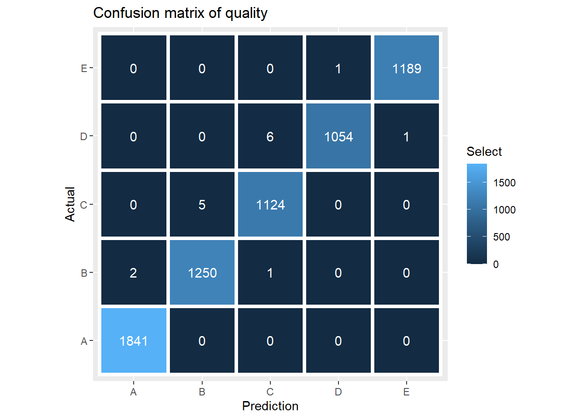

## Summary
The goal of this project is create model to predict the quality of how an exercise is performed using data from accelerometers on the belt, forearm, arm, and dumbbell of 6 participants. They were asked to perform barbell lifts correctly and incorrectly in 5 different ways. More information is available from the website here: [http://web.archive.org/web/20161224072740/http:/groupware.les.inf.puc-rio.br/har](http://web.archive.org/web/20161224072740/http:/groupware.les.inf.puc-rio.br/har) (see the section on the Weight Lifting Exercise Dataset).

## The data

The data used in this report was recorded by accelerometers on the belt, forearm, arm, and dumbbell of 6 participants. Participants were asked to perform one set of 10 repetitions of the Unilateral Dumbbell Biceps Curl in five different fashions:
exactly according to the specification (Class A), throwing the elbows to the
front (Class B), lifting the dumbbell only halfway (Class C), lowering the 
dumbbell only halfway (Class D) and throwing the hips to the front (Class E).
Class A corresponds to the specified execution of the exercise, while the other 4
classes correspond to common mistakes.


```r
library(readr)

if (!file.exists("data/pml-training.csv")) {
  download.file("https://d396qusza40orc.cloudfront.net/predmachlearn/pml-training.csv",
                destfile = "data/pml-training.csv")
}

if (!file.exists("data/pml-testing.csv")) {
  download.file("https://d396qusza40orc.cloudfront.net/predmachlearn/pml-testing.csv",
                destfile = "data/pml-testing.csv")
}

pml_training <- read_csv("data/pml-training.csv", na=c("NA","#DIV/0!",""))
pml_testing <- read_csv("data/pml-testing.csv", na=c("NA","#DIV/0!",""))
```

After looking at the data, I noticed that there were columns where 90% or more of
their data were NA so I decided to remove them.


```r
library(dplyr)

pml_training <- Filter(function(x) mean(is.na(x)) < 0.5, pml_training)
pml_testing <- Filter(function(x) mean(is.na(x)) < 0.5, pml_testing)

# Removing identification variables
pml_training <- pml_training[-(1:5)]

# Categorical variable
pml_training$classe <- factor(pml_training$classe)
```

The data were split in a 67-33 ratio to perform training and testing.


```r
library(caret)
set.seed(1234)
trainIndex <- createDataPartition(y=pml_training$classe, times=1, 
                                  p=0.67, list=FALSE)

pmltrain <- pml_training[trainIndex, ]
pmltest <- pml_training[-trainIndex, ]

train.names <- colnames(pml_training[, -ncol(pml_training)])
pml_testing <- pml_testing[train.names]
```


```r
set.seed(1234)
fitControl <- trainControl(method = "cv",
                           number = 5,
                           allowParallel = TRUE)

fit <- train(classe ~ ., method="rf", data=pmltrain, trControl = fitControl)
fit$finalModel
```

```

Call:
 randomForest(x = x, y = y, mtry = min(param$mtry, ncol(x))) 
               Type of random forest: classification
                     Number of trees: 500
No. of variables tried at each split: 28

        OOB estimate of  error rate: 0.25%
Confusion matrix:
     A    B    C    D    E  class.error
A 3738    0    0    0    1 0.0002674512
B    7 2533    3    1    0 0.0043238994
C    0    5 2286    2    0 0.0030527693
D    0    0    7 2148    0 0.0032482599
E    0    1    0    6 2410 0.0028961523
```

Now, we will use our model to predict test data and create a confusion matrix


```r
predictFit <- predict(fit, newdata = pmltest)
cm <- confusionMatrix(predictFit, pmltest$classe)
cm
```

```
Confusion Matrix and Statistics

          Reference
Prediction    A    B    C    D    E
         A 1841    2    0    0    0
         B    0 1250    5    0    0
         C    0    1 1124    6    0
         D    0    0    0 1054    1
         E    0    0    0    1 1189

Overall Statistics
                                         
               Accuracy : 0.9975         
                 95% CI : (0.996, 0.9986)
    No Information Rate : 0.2844         
    P-Value [Acc > NIR] : < 2.2e-16      
                                         
                  Kappa : 0.9969         
                                         
 Mcnemar's Test P-Value : NA             

Statistics by Class:

                     Class: A Class: B Class: C Class: D Class: E
Sensitivity            1.0000   0.9976   0.9956   0.9934   0.9992
Specificity            0.9996   0.9990   0.9987   0.9998   0.9998
Pos Pred Value         0.9989   0.9960   0.9938   0.9991   0.9992
Neg Pred Value         1.0000   0.9994   0.9991   0.9987   0.9998
Prevalence             0.2844   0.1935   0.1744   0.1639   0.1838
Detection Rate         0.2844   0.1931   0.1736   0.1628   0.1837
Detection Prevalence   0.2847   0.1939   0.1747   0.1630   0.1838
Balanced Accuracy      0.9998   0.9983   0.9971   0.9966   0.9995
```
<!-- -->


## Conclusions 

In this case, given the fact we are using random forest method, our in sample error is OOB and it has the value of 0.25%, in the other hand, our out sample error is 0.025.


## Bibliography

Velloso, E.; Bulling, A.; Gellersen, H.; Ugulino, W.; Fuks, H. Qualitative Activity Recognition of Weight Lifting Exercises. Proceedings of 4th International Conference in Cooperation with SIGCHI (Augmented Human '13) . Stuttgart, Germany: ACM SIGCHI, 2013.

